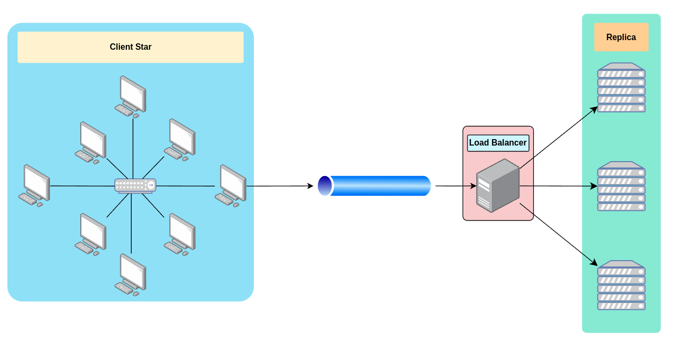

# Load Balancing in ns3

In this project, a load balancer has been implemented within the NS3 (Network Simulator 3) environment to simulate various execution scenarios and evaluate its performance. Load balancing is a critical aspect of modern computer networks and distributed systems, aiming to distribute incoming traffic or computational tasks evenly across multiple servers or resources. The utilization of NS3, a widely-used network simulation tool, provides an ideal platform for assessing the effectiveness of load balancing strategies in different network configurations and under varying workloads.



## Installation

### Requirements

- [ns-3 simulator v3.37](https://www.nsnam.org/).
- [c++ compiler](https://gcc.gnu.org/).
- [cmake](https://cmake.org/).
- [python3](https://www.python.org/).

The simulation uses the [ns-3 simulator](https://www.nsnam.org/), and has been developed and tested with the version 3.37.

### Build

First, make sure you have already completed all the step required for the installation of the simulator shown [here](https://www.nsnam.org/docs/release/3.37/tutorial/html/index.html).  
The directory structure should look something like this:

```bash
.
└── ns-allinone-3.39/
    └── ns-3.39/
        ├── ns3
        ├── examples/
        ├── src/
        ├── scratch/
        └── ...
```

Move to the `scratch` folder and clone the repository:

```bash
cd ns-allinone-3.39/ns-3.39/scratch
git clone https://github.com/rosariocannavo/NS3_Load_Balancer.git
```

Lastly, move back to the `ns-3.39` folder and build the simulation:

```bash
cd ..
./ns3 run "main.cc --PrintHelp"
```

## Usage
The simulation is highly configurable. The following options are available:

```bash
Usage: ./ns3 run "main.cc [options]"

Program Options:
    --nSpokes:                  Number of external nodes to place in the star [100]
    --seed:                     RNG seed [321]
    --nReplicaServers:          Number of replica server to allocate [3]
    --nActiveClient:            The total number of client nodes that request packets from the load balancer (1 to nSpokes) [30]
    --nPacketSentByEachClient:  The number of packets sent by each client node to the load balancer [5]
    --packetSecondsInterval:    The time interval between one packet send and another of a client (in Seconds) [1]
    --starDataRate:             The data rate (bandwidth) of the star channel. This parameter defines the rate at which data can be transmitted over the channel [1Mbps]
    --starDelay:                The delay (latency) of the star channel. This parameter defines the time it takes for packets to traverse a channel [2ms]
    --clientChannelErrorRate:   The error rate (or packet loss rate) of the communication channel between clients and the load balancer (0.10 = 10%) [0]
    --P2PDataRate:              The data rate (bandwidth) of the P2P channel (star to lb). This parameter defines the rate at which data can be transmitted over the channel [1Mbps]
    --P2PDelay:                 The delay (latency) of the P2P channel (star to lb). This parameter defines the time it takes for packets to traverse a channel [2ms]
    --replicaDataRate:          The data rate (bandwidth) of the Replica channel (lb to servers). This parameter defines the rate at which data can be transmitted over the channel [1Mbps]
    --replicaDelay:             The delay (latency) of the P2P channel (lb to servers). This parameter defines the time it takes for packets to traverse a channel (expressed in ns) [2ms]
    --stickyCacheDim:           The number of maximum entry of the cache for sticky session [33]
    --algorithm:                Algorithm used by the load balancer: 
 					                0: Round Robin; 
 					                1: IpHash 
 					                2: Random
					                    [2]

General Arguments:
    --PrintGlobals:              Print the list of globals.
    --PrintGroups:               Print the list of groups.
    --PrintGroup=[group]:        Print all TypeIds of group.
    --PrintTypeIds:              Print all TypeIds.
    --PrintAttributes=[typeid]:  Print all attributes of typeid.
    --PrintVersion:              Print the ns-3 version.
    --PrintHelp:                 Print this help message.

```
## Example of Usage
Let's now try running a simulation in which there are 3 replica servers, 20 clients each forwarding 5 packets, and the algorithm used by the load balancer is round robin
```bash
./ns3 run "scratch/LoadBalancerNetwork/main.cc  nSpokes=100 nReplicaServers=3 nActiveClient=20 nPacketSentByEachClient=5 algorithm=0"
```
The following graph produced by the simulator via the gnuplot library shows the simulation results:


## Conclusion
The simulations conducted clearly demonstrate that load balancers effectively produce the desired results. Through intelligent distribution of incoming network traffic, load balancers enhance system availability, improve scalability, and optimize overall performance. These findings underscore the critical role load balancers play in modern network infrastructures.
